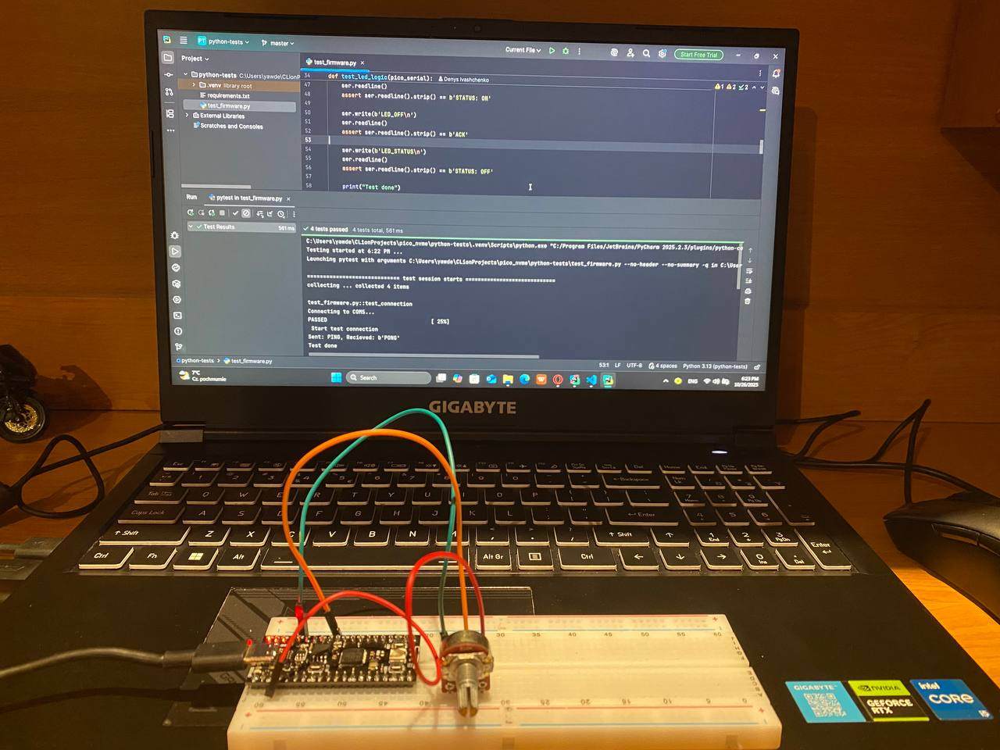

# Pico Firmware with Python E2E Test Suite

This project demonstrates a complete, full-cycle development workflow for an embedded system. It includes:

1.  **C Firmware (`main.c`):** A command-driven firmware for the Raspberry Pi Pico that simulates a basic hardware device (like an SSD controller) by managing GPIO, reading sensors (ADC), and handling simple memory operations.
2.  **Automated Test Framework (`test_project.py`):** A host-side Python script using the **Pytest** framework to perform automated end-to-end (E2E) testing on the firmware running on the hardware.

**[Live Simulation on Wokwi](https://wokwi.com/projects/445162055522048001)**
(Note: Wokwi simulates the C firmware. The Python test script must be run locally against real or simulated hardware.)

---

## ⚙️ How It Works

### 1. The Firmware (C)

The `main.c` program listens for newline-terminated commands via USB Serial.

**Implemented Commands:**
* `PING`: Responds with `PONG`. (Tests connection)
* `LED_ON` / `LED_OFF`: Controls the onboard LED.
* `LED_STATUS`: Returns `STATUS: ON` or `STATUS: OFF`.
* `READ_SMART`: Reads the ADC and returns a simulated temperature (`SMART_TEMP: 25.1`).
* `WRITE <lba> <data>`: Writes a byte to a simulated memory array (e.g., `WRITE 50 123`).
* `READ <lba>`: Reads a byte from the memory (e.g., `READ 50`).

### 2. The Test Suite (Python)

The `test_firmware.py` script runs on a host PC and connects to the Pico's serial port. It uses `pytest` to execute a series of validation tests:

* `test_connection`: Sends `PING` and expects `PONG`.
* `test_led_logic`: Turns the LED on/off and checks `LED_STATUS` to confirm the state change.
* `test_smart_reading`: Requests `READ_SMART` and validates that the temperature is within a realistic range.
* `test_storage_logic`: `WRITE`s data to two different "addresses" and then `READ`s them back to ensure data integrity.

---

## 🛠 Tech Stack

* **Firmware:** C, Raspberry Pi Pico SDK, CMake
* **Testing:** Python 3, Pytest, PySerial

---

## 🚀 How to Run

### 1. Wokwi Simulation (Easy Way)

1.  Open the [Wokwi project link](https://wokwi.com/projects/445162055522048001).
2.  The simulation will start automatically.
3.  In the "Serial Monitor" panel, you can manually type commands like `PING` or `LED_ON` to interact with the C firmware.

### 2. Local Run with Real Hardware (Professional Workflow)

**A. Compile and Flash the Firmware**

1.  Clone this repository.
2.  Build project.
3.  Copy the generated `pico_firmware.uf2` file to your Pico while it's in bootloader mode.

**B. Run the Python Tests**

1.  Ensure you have Python 3 installed.
2.  Install the required libraries:
    ```bash
    pip install pytest pyserial
    ```
3.  Find your Pico's serial port name (e.g., `COM3` on Windows, `/dev/ttyACM0` on Linux).
4.  **Edit `PICO_PORT`** in `test_project.py` to match your port:
    ```python
    PICO_PORT = 'COM3' # <-- Change this to your port
    ```
5.  From the project's root directory, run `pytest`:
    ```bash
    pytest -v
    ```
6.  Pytest will automatically discover the tests, connect to the Pico, and report the PASS/FAIL status for each test case.
7.  


